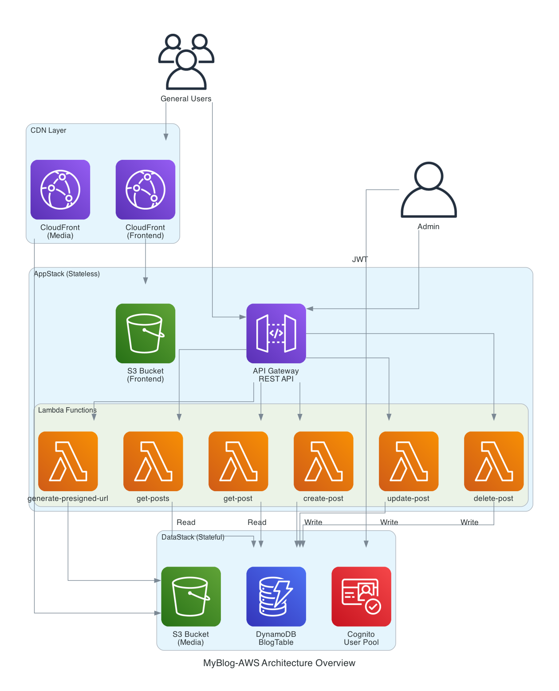
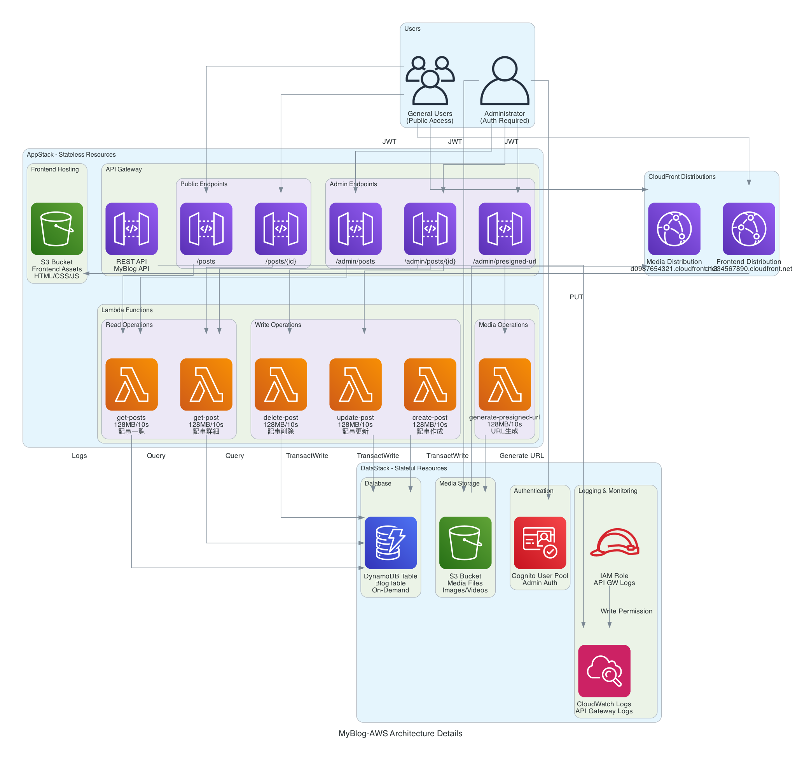

# MyBlog-AWS

個人の経験（画像・動画・テキスト）を共有するための、サーバーレスアーキテクチャによるオリジナルブログプラットフォーム開発プロジェクト。

[](https://github.com/Hayato-7812/MyBlog-AWS)
[](https://aws.amazon.com/)
[](https://aws.amazon.com/cdk/)

---

## 📋 目次

1. [プロジェクトの目的](#1-プロジェクトの目的)
2. [開発思想](#2-開発思想deep-learning--self-implementation)
3. [アーキテクチャ概要](#3-アーキテクチャ概要)
4. [技術スタック](#4-技術スタック)
5. [主な機能](#5-主な機能)
6. [ディレクトリ構造](#6-ディレクトリ構造)
7. [セットアップ](#7-セットアップ)
8. [デプロイ手順](#8-デプロイ手順)
9. [API仕様](#9-api仕様)
10. [ドキュメント](#10-ドキュメント)
11. [推奨教材・参考文献](#11-推奨教材参考文献)

---

## 1. プロジェクトの目的

本プロジェクトの主目的は、**「AWSサーバーレスアーキテクチャの深いキャッチアップ」** と **「自身の経験を共有するプラットフォームの構築」** の両立である。

具体的には、ヨーロッパでの生活やエンジニアとしての経験をコンテンツとして扱うが、インフラ層は「メディア（S3）とテキストを扱う汎用的なブログ基盤」として抽象的に実装する。これにより、バックエンドの再利用性を維持しつつ、フロントエンドの実装において独自性（オリジナリティ）を追求できる設計を目指す。

---

## 2. 開発思想：Deep Learning & Self-Implementation

本プロジェクトでは、真の技術習得を最優先事項とするため、以下の指針を徹底する。

* **公式リファレンス至上主義**: 実装の根拠は、原則としてAWS公式ドキュメントおよび各技術の公式リファレンスに求める。
* **非依存的な開発**: READMEの作成や思考の整理といった補助的タスクを除き、コードの実装においてはAI（LLM）による自動生成や過度なコード補完に頼らず、自力でのコーディングを貫く。
* **再利用性の考慮**: インフラはCDKを用いてコード管理し、特定のコンテンツに依存しない抽象化された基盤として構築する。

---

## 3. アーキテクチャ概要

MyBlog-AWSは、完全なサーバーレスアーキテクチャで構築されたブログプラットフォームです。

### アーキテクチャ図

#### 概要図


#### 詳細図


### 設計の特徴

#### 🏗️ 2つのCDK Stack構成

**DataStack（Stateful Resources）**
- DynamoDB Table: 記事データ保存（Single Table Design）
- S3 Bucket: メディアファイル保存（画像・動画）
- CloudFront Distribution: メディア配信用CDN
- Cognito User Pool: 管理者認証
- Cognito User Pool Client: アプリケーション統合

**AppStack（Stateless Resources）**
- S3 Bucket: フロントエンド静的ホスティング
- CloudFront Distribution: フロントエンド配信用CDN
- API Gateway: REST API（一般/管理者エンドポイント）
- Lambda Functions: 6個（CRUD + 画像アップロード + 記事詳細）

#### 🔐 セキュリティ設計

```
一般ユーザー:
├─ 認証: 不要
├─ アクセス: 公開記事のみ（status = published）
└─ エンドポイント: GET /posts, GET /posts/{postId}

管理者:
├─ 認証: Cognito User Pool（JWT）
├─ アクセス: すべての記事（draft/published/archived）
└─ エンドポイント: /admin/* すべて
```

#### ⚡ スケーラビリティ

- DynamoDB: On-Demand課金（自動スケーリング）
- Lambda: 同時実行数1000（リージョン単位）
- API Gateway: 10,000 req/sec
- CloudFront: グローバルエッジロケーション

---

## 4. 技術スタック

### Infrastructure as Code
- **AWS CDK**: v2.x（TypeScript）
- **CloudFormation**: 自動生成

### Backend
- **API Gateway**: REST API
- **Lambda**: Node.js 18.x
- **DynamoDB**: NoSQL Database（Single Table Design）
- **Cognito**: ユーザー認証・認可

### Storage & CDN
- **S3**: オブジェクトストレージ（Frontend + Media）
- **CloudFront**: グローバルCDN × 2

### Development
- **TypeScript**: Lambda関数・CDK
- **Node.js**: 18.x
- **AWS SDK v3**: @aws-sdk/client-*

### Documentation
- **Mermaid**: アーキテクチャ図（Markdown）
- **Diagrams as Code**: AWS公式アイコン使用（Python）

---

## 5. 主な機能

### 一般ユーザー向け機能
- ✅ 記事一覧表示（公開記事のみ）
- ✅ 記事詳細表示（本文・画像・タグ）
- ✅ タグフィルタリング
- ✅ ステータスフィルタリング

### 管理者向け機能
- ✅ 記事作成（Markdown + 画像）
- ✅ 記事更新（タイトル・本文・タグ・ステータス）
- ✅ 記事削除
- ✅ 画像アップロード（S3 Pre-signed URL）
- ✅ 下書き管理
- ✅ 記事公開・非公開切替

### データ管理
- ✅ DynamoDB Single Table Design
- ✅ GSI（Global Secondary Index）によるクエリ最適化
- ✅ PITR（Point-in-Time Recovery）有効化
- ✅ トランザクション処理（TransactWrite）

---

## 6. ディレクトリ構造

```
MyBlog-AWS/
├── README.md                          # プロジェクト概要（本ファイル）
├── documents/                         # 設計ドキュメント
│   ├── 00-dev_plan.md                 # 開発計画
│   ├── 01-requirement-definition.md   # 要件定義
│   ├── 02-1-wireframe-prompts.md      # ワイヤーフレーム
│   ├── 02-2-data-design.md            # データ設計
│   ├── 02-3-api-design.md             # API設計
│   ├── 02-4-infrastructure-design.md  # インフラ設計
│   ├── 02-5-infrastructure-final-design.md # 最終インフラ設計
│   ├── 03-1-iam-identity-center-setup.md   # IAM設定
│   ├── 04-1-DD-iplementation.md       # DataStack実装
│   ├── 04-2-data-stack-review.md      # DataStackレビュー
│   ├── 04-3-datastack-deployment-guide.md # デプロイガイド
│   ├── 04-4-Lambda-implementation-guide.md # Lambda実装ガイド
│   ├── 04-5-appstack-review.md        # AppStackレビュー
│   ├── 05-final-architecture.md       # 最終アーキテクチャ
│   ├── architecture_diagram.py        # Diagrams as Code
│   ├── ARCHITECTURE_DIAGRAM_README.md # 図生成ガイド
│   └── assets/images/                 # アーキテクチャ図
│       ├── architecture_overview.png  # 概要図
│       └── architecture_details.png   # 詳細図
├── myblog-aws/                        # CDKプロジェクト
│   ├── bin/
│   │   └── myblog-aws.ts              # CDKアプリエントリーポイント
│   ├── lib/
│   │   ├── data-stack.ts              # DataStack定義
│   │   └── app-stack.ts               # AppStack定義
│   ├── lambda/                        # Lambda関数
│   │   ├── get-posts/                 # 記事一覧取得
│   │   ├── get-post/                  # 記事詳細取得
│   │   ├── create-post/               # 記事作成
│   │   ├── update-post/               # 記事更新
│   │   ├── delete-post/               # 記事削除
│   │   └── generate-presigned-url/    # 画像アップロード
│   ├── package.json
│   ├── tsconfig.json
│   └── cdk.json
└── wire-frame/                        # フロントエンドプロトタイプ
    └── Article List Screen/           # 記事一覧画面

各Lambda関数の構成:
lambda/<function-name>/
├── index.ts       # エントリーポイント（CORS, エラーハンドリング）
├── handler.ts     # ビジネスロジック
├── types.ts       # 型定義
└── package.json   # 依存関係
```

---

## 7. セットアップ

### 前提条件

```bash
# 必要なツール
- Node.js 18以上
- AWS CLI 2.x
- AWS CDK CLI
- Python 3.7以上（Diagrams as Code用）
- Graphviz（Diagrams as Code用）
```

### 1. リポジトリクローン

```bash
git clone https://github.com/Hayato-7812/MyBlog-AWS.git
cd MyBlog-AWS
```

### 2. AWS プロファイル設定（SSO）

```bash
# AWS SSO設定（推奨）
aws configure sso --profile myblog-dev

# プロンプトに従って入力:
# SSO start URL: https://your-sso-portal.awsapps.com/start
# SSO Region: ap-northeast-1（例）
# Select account: 該当アカウントを選択
# Select role: AdministratorAccess（または適切なロール）
# CLI default client Region: ap-northeast-1
# CLI default output format: json
# CLI profile name: myblog-dev

# ログイン（初回）
aws sso login --profile myblog-dev

# 認証確認
aws sts get-caller-identity --profile myblog-dev
```

**再ログイン（セッション期限切れ時）**:
```bash
# セッションが切れた場合、再度ログイン
aws sso login --profile myblog-dev

# または、CDKコマンド実行時に自動的にブラウザが開く
cdk deploy --profile myblog-dev
# → セッション切れの場合、自動的にブラウザでSSO認証画面が開きます
```

**注意**: 
- SSOセッションは通常8時間有効です
- IAMユーザーを使用する場合は `aws configure --profile myblog-dev` を実行してください

### 3. CDK依存関係インストール

```bash
cd myblog-aws
npm install
```

### 4. Lambda依存関係インストール

```bash
# 各Lambda関数の依存関係
cd lambda/get-posts && npm install && cd ../..
cd lambda/get-post && npm install && cd ../..
cd lambda/create-post && npm install && cd ../..
cd lambda/update-post && npm install && cd ../..
cd lambda/delete-post && npm install && cd ../..
cd lambda/generate-presigned-url && npm install && cd ../..
```

### 5. CDK Bootstrap（初回のみ）

```bash
cdk bootstrap aws://ACCOUNT_ID/REGION --profile myblog-dev
```

---

## 8. デプロイ手順

### 1. ビルド

```bash
cd myblog-aws
npm run build
```

### 2. 差分確認

```bash
cdk diff --profile myblog-dev
```

### 3. デプロイ

```bash
# 全Stackデプロイ
cdk deploy --all --profile myblog-dev

# 個別デプロイ
cdk deploy MyBlog-DataStack --profile myblog-dev
cdk deploy MyBlog-AppStack --profile myblog-dev
```

### 4. 出力確認

```bash
# デプロイ完了後、以下の情報が出力される

MyBlog-DataStack:
  TableName = MyBlogDataStack-MyBlogTable-XXXXX
  MediaBucketName = myblogdatastack-mediabucket-xxxxx
  MediaDistributionDomainName = d0987654321.cloudfront.net
  UserPoolId = ap-northeast-1_XXXXX
  UserPoolClientId = xxxxxxxxxxxxx

MyBlog-AppStack:
  FrontendBucketName = myblogappstack-frontendbucket-xxxxx
  DistributionDomainName = d1234567890.cloudfront.net
  ApiUrl = https://xxxxx.execute-api.ap-northeast-1.amazonaws.com/prod
```

### 5. 管理者ユーザー作成

```bash
# Cognito Userを作成
aws cognito-idp admin-create-user \
  --user-pool-id <USER_POOL_ID> \
  --username admin \
  --user-attributes Name=email,Value=your-email@example.com \
  --profile myblog-dev

# パスワード設定
aws cognito-idp admin-set-user-password \
  --user-pool-id <USER_POOL_ID> \
  --username admin \
  --password YourSecurePassword123! \
  --permanent \
  --profile myblog-dev
```

---

## 9. API仕様

### 一般ユーザー向けAPI（認証不要）

```
GET /posts
  → 記事一覧取得（公開記事のみ）
  Query Parameters:
    - status: published（固定）
    - tag: タグ名（オプション）
    - limit: 件数制限（デフォルト: 10）
    - lastEvaluatedKey: ページネーション用

GET /posts/{postId}
  → 記事詳細取得（公開記事のみ）
  Path Parameters:
    - postId: 記事ID（ULID）
```

### 管理者向けAPI（Cognito認証必須）

```
GET /admin/posts
  → 記事一覧取得（全ステータス）
  Query Parameters:
    - status: draft | published | archived（オプション）
    - tag: タグ名（オプション）
    - limit: 件数制限
  Headers:
    - Authorization: Bearer <JWT_TOKEN>

GET /admin/posts/{postId}
  → 記事詳細取得（下書き含む）
  Headers:
    - Authorization: Bearer <JWT_TOKEN>

POST /admin/posts
  → 記事作成
  Headers:
    - Authorization: Bearer <JWT_TOKEN>
  Body:
    - title: string
    - summary: string
    - thumbnail: string
    - contentBlocks: ContentBlock[]
    - tags: string[]
    - status: "draft" | "published"

PUT /admin/posts/{postId}
  → 記事更新
  Headers:
    - Authorization: Bearer <JWT_TOKEN>
  Body: （記事作成と同じ）

DELETE /admin/posts/{postId}
  → 記事削除
  Headers:
    - Authorization: Bearer <JWT_TOKEN>

POST /admin/presigned-url
  → Pre-signed URL生成（画像アップロード用）
  Headers:
    - Authorization: Bearer <JWT_TOKEN>
  Body:
    - fileName: string
    - fileType: string
  Response:
    - uploadUrl: string（15分有効）
    - fileUrl: string（CloudFront URL）
```

---

## 10. ドキュメント

### 設計ドキュメント

| ドキュメント | 説明 |
|------------|------|
| [要件定義書](documents/01-requirement-definition.md) | プロジェクトの要件定義 |
| [データ設計書](documents/02-2-data-design.md) | DynamoDB Single Table Design |
| [API設計書](documents/02-3-api-design.md) | REST API仕様 |
| [インフラ設計書](documents/02-5-infrastructure-final-design.md) | 最終インフラ設計 |
| [最終アーキテクチャ](documents/05-final-architecture.md) | Mermaid図・詳細設計 |

### 実装ガイド

| ドキュメント | 説明 |
|------------|------|
| [DataStack実装](documents/04-1-DD-iplementation.md) | DataStack実装ガイド |
| [Lambda実装](documents/04-4-Lambda-implementation-guide.md) | Lambda関数実装ガイド |
| [デプロイガイド](documents/04-3-datastack-deployment-guide.md) | デプロイ手順 |

### アーキテクチャ図

- [Diagrams as Code使用ガイド](documents/ARCHITECTURE_DIAGRAM_README.md)
- [概要図](documents/assets/images/architecture_overview.png)
- [詳細図](documents/assets/images/architecture_details.png)

---

## 11. 推奨教材・参考文献

### キャッチアップ教材

* [AWSサーバーレス開発をフロントからバックエンドまで体系的に学ぶ10日間](https://www.udemy.com/course/aws-serverless-10days/)

### 参考文献（ブログ構築の先達）

* [AWS 上で自分専用のブログシステムを構築した話 - 執筆環境から公開までを AWS サービスでつなぎ込む](https://www.ketancho.net/entry/2018/05/07/080000)

### AWS公式ドキュメント

* [AWS CDK Documentation](https://docs.aws.amazon.com/cdk/)
* [Amazon DynamoDB Developer Guide](https://docs.aws.amazon.com/dynamodb/)
* [AWS Lambda Developer Guide](https://docs.aws.amazon.com/lambda/)
* [Amazon API Gateway Developer Guide](https://docs.aws.amazon.com/apigateway/)
* [Amazon Cognito Developer Guide](https://docs.aws.amazon.com/cognito/)

---

## 📊 プロジェクトステータス

```
✅ バックエンドインフラ: 完成（100%）
├─ ✅ DataStack実装
├─ ✅ AppStack実装
├─ ✅ Lambda関数 × 6実装
├─ ✅ API Gateway実装
└─ ✅ ドキュメント整備

🚧 フロントエンド: 開発中
├─ ✅ ワイヤーフレーム作成
└─ 🚧 React/Next.js実装

📋 今後のタスク:
- [ ] フロントエンド実装
- [ ] 統合テスト
- [ ] 本番デプロイ
- [ ] カスタムドメイン設定（Route53）
- [ ] SSL証明書設定（ACM）
```

---

## 💰 コスト試算

### 初期段階（月間1,000PV）
- AWS無料枠内: **約$0/月**

### 成長後（月間10,000PV）
- 約**$8.09/月**
  - DynamoDB: $3.00
  - Lambda: $0.22
  - API Gateway: $0.35
  - S3: $0.27
  - CloudFront: $4.25

詳細は[最終アーキテクチャ](documents/05-final-architecture.md#コスト試算)を参照。

---

## 🤝 コントリビューション

本プロジェクトは個人学習用のため、外部からのコントリビューションは受け付けていません。

---

## 📝 ライセンス

このプロジェクトは個人学習用です。

---

## 👤 Author

**Hayato Shimizu**
- GitHub: [@Hayato-7812](https://github.com/Hayato-7812)

---

**作成日**: 2026年2月11日  
**最終更新**: 2026年2月11日  
**バージョン**: 1.0.0
