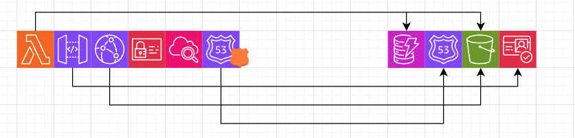

# Infrastructure Design (インフラ構成設計)

## 1. 設計方針

### 1.1 IaC（Infrastructure as Code）の採用

* **ツール**: AWS CDK (TypeScript)
* **バージョン管理**: すべてのインフラ定義をGitで管理
* **再現性**: いつでも同じ環境を再構築可能

### 1.2 Stack分割の基本方針

> **🤔 考えるべきポイント:**
> 
> Stack分割は、AWSリソースを「ライフサイクル」と「依存関係」に基づいて分類する作業です。
> 以下の観点で考えてみましょう：
>
> 1. **削除しても問題ないリソースはどれ？**
>    - 例：Lambda関数は削除して再デプロイしても、データは失われない
>    - 例：DynamoDBテーブルを削除すると、記事データが全て消える
>
> 2. **頻繁に更新するリソースはどれ？**
>    - 例：Lambda関数のコードは頻繁に変更する
>    - 例：DynamoDBテーブルの構造は一度決めたら滅多に変更しない
>
> 3. **他のリソースに依存されているリソースはどれ？**
>    - 例：DynamoDBテーブルはLambda関数から参照される
>    - 例：S3バケットはCloudFrontから参照される

---

## 2. Stack分割案

### 2.1 【あなたが考えてください】どのリソースをどのStackに配置するか？

以下のリソースを、Stateful StackとStateless Stackに分類してみましょう。

#### プロジェクトで使用する予定のAWSリソース一覧

- [ ] DynamoDB テーブル（記事データ）
- [ ] S3 バケット（メディアファイル保管）
- [ ] CloudFront Distribution
- [ ] API Gateway REST API
- [ ] Lambda 関数（記事取得）
- [ ] Lambda 関数（記事作成）
- [ ] Lambda 関数（記事更新）
- [ ] Lambda 関数（記事削除）
- [ ] Lambda 関数（Pre-signed URL生成）
- [ ] Cognito User Pool（ユーザー認証）
- [ ] IAM Role（Lambda実行ロール）
- [ ] CloudWatch Logs（ログ保管）

自分で追加
- [ ] Route53 (DNSサーバ)

#### Stateful Stack（状態を持つリソース）

> **💡 ヒント:** 
> - 「データが保存される」リソース
> - 「削除するとサービスに致命的な影響がある」リソース
> - 「ライフサイクルが長い」リソース

**このStackに含めるべきリソース:**
```
ここにリソースをリストアップしてください

例：
- DynamoDB テーブル: myblog-posts-table
  理由：記事データが保存されており、削除すると全データが失われる

- Cloud Watch Logs
  理由：削除すると全てのログが消えてしまう

- S3バケット : myblog-media
  理由：削除すると記事に添付した画像や動画ファイルが全て消えてしまう

- Cognito ser Pool
  理由:削除すると、管理者の情報(パスワードなど)が失われる

- Route53
  理由：削除すると発行したドメインの情報が失われる

```

#### Stateless Stack（状態を持たないリソース）

> **💡 ヒント:**
> - 「削除して再作成しても問題ない」リソース
> - 「頻繁に更新される」リソース
> - 「コードの変更に伴って更新される」リソース

**このStackに含めるべきリソース:**
```
ここにリソースをリストアップしてください

例：
- Lambda 関数: get-posts-function
  理由：コード変更のたびに更新が必要。削除しても再デプロイすれば復元可能

- API Gateway REST API
  理由：APIの更新が必要、削除しても再デプロイすれば復元可

- CloudFront Distribution
  理由：CDNの設定は、サービスの設定で指定可能

- IAM Role
  理由：Lambda関数やAPIエンドポイントを追加するたびに新たに設定する必要がある
```

---

### 2.2 【フィードバック】Stack分割の評価

#### ✅ **非常に良い判断**

**Stateful Stackについて:**

1. **DynamoDB テーブル** ✅
   - 理由も完璧：「記事データが保存されており、削除すると全データが失われる」
   - データの永続性を正しく理解しています

2. **S3バケット** ✅
   - 理由も適切：「削除すると記事に添付した画像や動画ファイルが全て消えてしまう」
   - メディアファイルは復元不可能なので、完全に正しい判断です

3. **Cognito User Pool** ✅
   - 理由も適切：「削除すると、管理者の情報(パスワードなど)が失われる」
   - 認証情報は重要なステートなので正しいです

4. **Route53** ✅
   - 理由も適切：「削除すると発行したドメインの情報が失われる」
   - 自分で追加したのも良い視点です

**Stateless Stackについて:**

1. **Lambda 関数** ✅
   - 完璧です。コード変更で頻繁に更新、削除しても再デプロイで復元可能

2. **API Gateway** ✅
   - 正しい判断です。設定変更が多く、Lambdaと密接に連携

3. **CloudFront Distribution** ✅
   - 良い判断です。設定変更が可能で、再作成可能

4. **IAM Role** ✅
   - 正しいです。Lambda関数とセットで管理する必要があります

#### ⚠️ **検討が必要な項目**

**1. CloudWatch Logsについて**

```
あなたの分類: Stateful Stack
理由: 削除すると全てのログが消えてしまう
```

**これは一部正しいですが、以下を検討してください:**

**Option 1: Stateful Stackに含める（あなたの判断）**
- メリット: ログの永続性が保証される
- デメリット: Stateful Stackが肥大化する

**Option 2: Stateless Stackに含める（推奨）**
- 理由:
  - CloudWatch LogsはLambda関数と密接に関連
  - Lambda関数を削除しても、ログは自動的に保持期間内は残る
  - CDKでログ保持期間（例: 30日）を設定すれば重要ログは保護される
  - 完全に失われても、アプリケーションの機能に影響しない

**Option 3: 別の "Monitoring Stack" を作る**
- より進んだ設計として、監視系リソースを分離する方法もあります

**推奨:** 初期段階では、CloudWatch LogsはStateless Stackに含めるか、Lambda関数に自動作成させるのが一般的です。

**2. Route53の細分化とレコード設計**

Route53は少し特殊で、さらに細かく考える必要があります：

**Route53 HostedZone（ドメイン管理）:**
- これは **Stateful** です ✅
- 理由：削除するとDNS設定が失われ、ドメインが使えなくなる
- あなたの判断は正しいです

**Route53のレコード（DNSレコード）:**
- これは **Stateless** でもOKです
- ターゲット（CloudFrontやAPI Gateway）を指すだけなので、再作成可能
- **重要**: レコードはそのターゲットと同じStackに配置することを推奨

**Route53のレコードタイプと実装方針（CDK設計上の重要ポイント）:**

DNSレコードには主に以下の種類がありますが、**AWSリソースと連携する場合は必ず「Aliasレコード」を使用** します：

1. **Aレコード（Address Record）**
   - 通常：ドメイン名をIPv4アドレスに紐付ける
   - AWS Alias版：AWSリソース（CloudFront、ALB等）に直接紐付ける
   
2. **CNAMEレコード（Canonical Name Record）**
   - ドメイン名を別のドメイン名に紐付ける
   - **制約**: ゾーン頂点（例：`example.com`）には設定不可（DNS仕様の制限）
   - サブドメイン（例：`www.example.com`）のみ使用可能

3. **Aliasレコード（Route53独自の機能）** ← これを使う！
   - AWSリソース専用の特別なAレコード
   - **メリット**:
     - ゾーン頂点でも使える（CNAMEの制約を回避）
     - クエリ料金が無料（Route53内部の解決）
     - AWSリソースのエンドポイント変更に自動追従
   - **CDKのベストプラクティス**: AWSリソースには必ずAliasを使用

**MyBlogプロジェクトでの具体的な設定:**

```
ドメイン                                  レコードタイプ    ターゲット
--------------------------------------------------------
shimizuhayato-myblog-aws.com           Alias (A)       CloudFront Distribution
api.shimizuhayato-myblog-aws.com       Alias (A)       API Gateway Custom Domain
```

**CDK実装の参考:**

```typescript
// CloudFront用のAliasレコード
new route53.ARecord(this, 'WebsiteAliasRecord', {
  zone: hostedZone,
  target: route53.RecordTarget.fromAlias(
    new targets.CloudFrontTarget(distribution)
  ),
});

// API Gateway用のAliasレコード
new route53.ARecord(this, 'ApiAliasRecord', {
  zone: hostedZone,
  recordName: 'api',  // api.shimizuhayato-myblog-aws.com
  target: route53.RecordTarget.fromAlias(
    new targets.ApiGatewayDomain(apiGatewayDomain)
  ),
});
```

**HTTPS対応のための注意点:**

カスタムドメインでHTTPSを使用するには、ACM（AWS Certificate Manager）証明書が必要です：

- **CloudFront用**: `us-east-1`リージョンの証明書が必須
- **API Gateway用**: デプロイするリージョンの証明書
- **CDK**: `CertificateValidation.fromDns(hostedZone)`で自動検証が可能

**Stack配置の推奨:**

```
Stateful Stack:
  - Route53 HostedZone

Stateless Stack:
  - CloudFront Distribution
  - Route53 Alias Record → CloudFront
  - API Gateway Custom Domain
  - Route53 Alias Record → API Gateway
  - ACM証明書（CloudFront用、API Gateway用）
```

この設計により、リソースとそのDNS設定が一緒にデプロイされ、一貫性が保たれます。

**3. CloudFront Distributionについて**

あなたはStateless Stackに分類しましたが、これは **正解** です。ただし注意点があります：

- CloudFrontは作成に時間がかかる（15-30分）
- 頻繁に変更しない
- しかし、ドメインやSSL証明書の設定変更はありうる

**あなたの判断（Stateless Stack）は適切です。** 将来的にサービスが安定したら、別の "CDN Stack" に分離することも検討できます。

#### 📊 **改善されたStack分割の推奨案**

以下が改善版の分類です：

**Stateful Stack:**
```
✅ DynamoDB テーブル
✅ S3 バケット（メディアファイル）
✅ Cognito User Pool
✅ Route53 HostedZone（ドメイン管理）
```

**Stateless Stack:**
```
✅ Lambda 関数（全て: get-posts, create-post, update-post, delete-post, generate-presigned-url）
✅ API Gateway REST API
✅ API Gateway Custom Domain
✅ IAM Role（Lambda実行ロール）
✅ CloudFront Distribution
✅ Route53 Alias Records（CloudFront用、API Gateway用）
✅ ACM証明書（CloudFront用はus-east-1、API Gateway用はデプロイリージョン）
⚠️ CloudWatch Logs（推奨: Stateless Stackまたは自動作成）
```

**注記:** Route53のAliasレコードとACM証明書は、そのターゲットリソース（CloudFront、API Gateway）と同じStackに配置することで、デプロイの一貫性が保たれます。

#### 🎯 **将来的な拡張案（3-Stack構成）**

大規模になったら、以下のような構成も考えられます：

1. **Data Stack（Stateful）**: DynamoDB, S3, Cognito
2. **Compute Stack（Stateless）**: Lambda, API Gateway, IAM Role
3. **Network Stack**: CloudFront, Route53, ACM証明書, CloudWatch Logs

#### 💡 **学習成果の総評**

**素晴らしい点:**
- DynamoDB, S3, Cognitoの判断は完璧
- 「データが失われる」という観点で正しく判断できている
- Route53を自分で追加し、適切に分類できている
- Stateless Stackの主要リソースも正しく分類できている

**さらに良くするために:**
- CloudWatch Logsの扱いを再検討
- Route53をHostedZoneとRecordsに分けて考える
- 将来的なStack分割の拡張性も意識する

---

## 3. Stack間の依存関係

### 3.1 【あなたが考えてください】どのように依存関係を解決するか？

> **🤔 考えるべきポイント:**
>
> Stateless Stack（Lambda）は、Stateful Stack（DynamoDB）の情報が必要です。
> 
> 例：Lambda関数はDynamoDBのテーブル名を知る必要がある
>
> **質問：どうやってStateless StackにStateful Stackの情報を渡しますか？**
>
> ヒント：CDKには以下の方法があります
> - CloudFormation Outputs / Exports
> - SSM Parameter Store
> - Stack間の直接参照

#### スタック間共有の使い分けまとめ

1. Stack間の直接参照（同一アプリ内）

* **内容**: コード上でリソースの変数をそのまま次のスタックに渡す。
* **メリット**: CDKが裏側で自動処理するため、最も簡単でミスがない。(開発者がARNなどを意識する必要がなく、型安全性が最も高い。)
* **使い所**: **「DataStack」から「AppStack」へ**など、同じプロジェクト内での共有。

2. SSM Parameter Store（アプリ間）

* **内容**: AWSの共通保管庫（SSM）に値を書き込み、他から読み取る。
* **メリット**: スタック同士を独立（疎結合）に保てる。(アプリケーションの境界を越えて情報を共有できる)
* **使い所**: **全く別のプロジェクトやチーム**とリソース情報を共有する場合。

3. CloudFormation Outputs（人間・外部用）

* **内容**: デプロイ結果としてコンソール等に値を表示させる。
* **メリット**: ターミナルでURLやARNを直接確認できる。
* **使い所**: **APIエンドポイントの確認**や、フロントエンド開発者への情報通知。

#### 使い分けの判断基準

| 共有範囲 | 推奨される方法 | 理由 |
| --- | --- | --- |
| **同一アプリ・同一プロジェクト** | **Stack間の直接参照** | 最も簡単で、型安全性が高く、CDKに任せられるため。 |
| **異なるアプリ・組織間の共有** | **SSM Parameter Store** | 疎結合を維持でき、権限管理もしやすいため。 |
| **人間による確認・フロントエンド連携** | **CloudFormation Outputs** | コンソール等で見ることができ、外部への通知に適しているため。 |


#### 解決方法を考えてみましょう

```typescript
// Stateful Stackで何をExportすべきか？

// 例：
// DynamoDBテーブルのARN
// DynamoDBテーブル名
// S3バケット名
// ?

// Stateless Stackでどうやってそれを参照するか？
```

#### 自分で考えた依存関係
- Lambda関数はDynamoDBのテーブル名を知る必要がある -> データ保存先、参照先のテーブル
- Lambda関数はS3のテーブルバケット名を知る必要がある -> PreSigned URLの作成のためにバケットの所在を知る必要がある
- API GatewayはCognitoUserPoolの情報を知る必要がある -> 認証を行う(ログイン)際に情報を照合する


```typescript
// Stateful Stackで何をExportすべきか？
DynamoDBテーブルのARN
DynamoDBテーブル名
S3バケット名
CognitoUserPoolのARN

// Stateless Stackでどうやってそれを参照するか？
Stack間の直接参照
```

### MyBlog-AWSでの適用

「DataStack」と「AppStack」は同じアプリ（`bin/myblog-aws.ts`）で管理するため、基本的には**「Stack間の直接参照」**を使用するのがベストプラクティスに沿った設計となる。


---

### 3.2 【フィードバック】Stack間依存関係の評価

#### ✅ **非常に優れた理解**

**3つの共有方法の理解:**
- Stack間の直接参照、SSM Parameter Store、CloudFormation Outputsの違いと使い分けを正確に理解しています
- 判断基準の表も明確で、実務でそのまま使えるレベルです ✅

**選択した方法:**
- **「Stack間の直接参照」を選択** - これは **最適な判断** です ✅
- 理由：DataStackとAppStackは同一CDKアプリ内であり、この方法が最も型安全で管理しやすいためです

#### ✅ **依存関係の識別 - ほぼ完璧**

正しく識別できている依存関係：

1. **Lambda → DynamoDBテーブル名** ✅
   - 理由：データの保存・取得先として必要
   
2. **Lambda → S3バケット名** ✅
   - 理由：PreSigned URL生成のためにバケット情報が必要
   
3. **API Gateway → CognitoUserPool** ✅
   - 理由：認証時にユーザー情報を照合する必要がある

#### ⚠️ **追加で考慮すべき依存関係**

以下の依存関係が抜けています：

**1. CloudFront → S3バケット**
- CloudFront DistributionがS3バケットを **オリジン（配信元）** として参照します
- 静的コンテンツ（フロントエンドのHTML/CSS/JS）やメディアファイルの配信に必要

**2. Route53 Aliasレコード → HostedZone**
- Stateless StackでRoute53 Aliasレコードを作成する際、HostedZoneの情報が必要です
- セクション2.2で説明したように、レコードはターゲットと同じStackに配置しますが、HostedZone自体はStateful Stackにあります

#### ⚠️ **Exportする情報について - 改善の余地**

**ユーザーが挙げた項目:**
```
- DynamoDBテーブルのARN
- DynamoDBテーブル名
- S3バケット名
- CognitoUserPoolのARN
```

**改善ポイント:**

**1. ARNと名前の両方をExportする必要はない**

CDKのStack間直接参照では、**リソースオブジェクト全体を渡す**のがベストプラクティスです。

- ❌ 避けるべき：ARN、テーブル名、バケット名を個別に文字列で渡す
- ✅ 推奨：DynamoDBテーブルオブジェクト、S3バケットオブジェクトをそのまま渡す

**なぜリソースオブジェクト全体を渡すべきか：**
- ARN、名前、その他の属性すべてに自動的にアクセス可能
- 型安全性が保たれる（TypeScriptの型チェックが効く）
- CDKが自動的に依存関係を管理
- 権限付与（IAM Policy）が簡単になる

**2. 追加すべき情報**

以下も Stateful Stack から渡す必要があります：

- **S3バケットオブジェクト**（CloudFront用）
- **Route53 HostedZoneオブジェクト**（Aliasレコード作成用）

#### 📊 **改善されたExport設計の考え方**

**Stateful Stack (DataStack) から渡すべき情報:**

| リソース | 渡す情報 | 使用先（Stateless Stack） |
|---------|---------|-------------------------|
| DynamoDB | テーブルオブジェクト | Lambda関数（環境変数、IAM権限） |
| S3バケット | バケットオブジェクト | Lambda関数、CloudFront |
| Cognito User Pool | UserPoolオブジェクト | API Gateway Authorizer |
| Route53 HostedZone | HostedZoneオブジェクト | Route53 Aliasレコード |

**重要な原則:**
- 文字列（名前やARN）ではなく、**リソースオブジェクト全体** を渡す
- これにより、Stateless Stackで必要な情報すべてにアクセス可能
- 例：`table.tableName`、`table.tableArn`、`bucket.bucketName` など

#### 🎯 **CDKベストプラクティス補足**

**1. リソースオブジェクトを渡すメリット:**
- **型安全性**: TypeScriptの型チェックが効く
- **自動依存関係管理**: CDKがデプロイ順序を自動決定
- **権限管理が簡単**: DynamoDBの `grantReadData()` メソッドなどが使える
- **属性に自動アクセス**: `.tableName`、`.tableArn`、`.bucketName` など

**2. CloudFormation Outputsとの併用:**

「Stack間の直接参照」と「CloudFormation Outputs」は **併用** することが多いです：

- **Stack間の直接参照**: プログラム的なリソース共有（CDKコード内）
- **CloudFormation Outputs**: 人間が確認するための出力
  - デプロイ後にターミナルで確認
  - APIエンドポイントURLの表示
  - フロントエンド開発者への情報共有

#### 💡 **学習成果の総評**

**素晴らしい点:**
- 3つの共有方法を正確に理解している
- 使い分けの判断基準が明確
- 主要な依存関係を正しく識別
- 「Stack間の直接参照」の選択が最適

**さらに良くするために:**
- CloudFront → S3、Route53レコード → HostedZoneの依存関係も考慮
- ARNと名前を個別にExportするのではなく、リソースオブジェクト全体を渡す設計を理解
- リソースオブジェクトから必要な属性（名前、ARN等）を取得できることを意識

---

## 4. デプロイ順序

### 4.1 【あなたが考えてください】どの順番でデプロイすべきか？

> **🤔 考えるべきポイント:**
>
> Stack間に依存関係がある場合、デプロイの順序が重要です。
>
> **質問：Stateful StackとStateless Stackは、どちらを先にデプロイすべきですか？**
>
> なぜそう考えましたか？

#### 回答
- Stateful Stackからデプロイすべき
理由：依存関係がある場合、依存先のリソースを定義してからでないと論理的な関係が構築できない

#### デプロイフローを考えてみましょう

```
ステップ1: Stateful Stack
理由: for Stateless Stack

ステップ2: Stateless Stack
理由: 

ステップ3: ?（必要であれば）
理由: ?
```

---

### 4.2 【フィードバック】デプロイ順序の評価

#### ✅ **完璧な判断**

**ユーザーの回答は100%正しいです。**

**デプロイ順序:**
```
1. Stateful Stack (DataStack) → 先にデプロイ
2. Stateless Stack (AppStack) → 後にデプロイ
```

**理由:**
- Stateless StackがStateful Stackのリソース（DynamoDB、S3等）を参照する
- 参照される側（依存される側）を先にデプロイする必要がある
- これは依存関係の基本原則

#### 📋 **デプロイフローの完成版**

```
ステップ1: Stateful Stack (DataStack)
理由: Stateless Stackが依存するリソース（DynamoDB、S3、
      Cognito、Route53 HostedZone）を作成

ステップ2: Stateless Stack (AppStack)
理由: Stateful Stackのリソースを参照して、Lambda、
      API Gateway、CloudFront、Route53 Recordsを作成

ステップ3: （通常は不要）
理由: 2つのStackで完結。将来的にMonitoring Stack等を
      分離する場合は最後にデプロイ
```

#### 🔄 **更新・削除時の注意点**

**更新時:**
- Stateful Stackのみ更新 → Stateful Stackのみデプロイ
- Stateless Stackのみ更新 → Stateless Stackのみデプロイ
- 両方を更新 → Stateful Stack → Stateless Stackの順

**削除時:**
- **逆順で削除**: Stateless Stack → Stateful Stack
- 理由：依存関係があるため、先にStateful Stackを削除するとエラーになる

#### 💡 **CDKの自動依存関係管理**

**重要なポイント:**
- CDKは依存関係を自動的に解決する
- `cdk deploy --all` で依存順に自動デプロイされる
- ただし、概念として理解しておくことは非常に重要

**デプロイ時間の目安:**
- Stateful Stack: 2-5分
- Stateless Stack: 15-30分（CloudFrontが時間かかる）
- 合計: 初回デプロイで約20-35分

#### 🎓 **学習成果の総評**

**素晴らしい点:**
- デプロイ順序の判断が完璧 ✅
- 依存関係の概念を正しく理解 ✅
- 理由も適切に説明できている ✅

---

## 5. 環境分離（将来的な拡張） 【skip】

> **💭 発展的な考察:**
>
> 現時点では本番環境のみですが、将来的に開発環境を作る場合を想定してみましょう。
>
> **質問：**
> - 開発環境と本番環境で、Stackをどう分けますか？
> - 同じCDKコードで両方の環境をデプロイできますか？
>
> ヒント：CDKの `context` や環境変数を使う方法があります

---

## 6. リソース命名規則

### 6.1 【あなたが考えてください】統一的な命名規則を決めましょう

> **🤔 考えるべきポイント:**
>
> リソース名には、以下の情報を含めると管理しやすくなります：
> - プロジェクト名
> - 環境（本番/開発）
> - リソースタイプ
> - 用途

#### 命名規則の例

```
パターン1: {project}-{env}-{resource-type}-{purpose}
例：myblog-prod-lambda-get-posts

パターン2: {env}-{project}-{purpose}-{resource-type}
例：prod-myblog-get-posts-lambda

どちらが良いと思いますか？あるいは独自のパターンを考えてみましょう。
```

**あなたの命名規則:**
```
パターン1を採用: {project}-{env}-{resource-type}-{purpose}
```

---

### 6.2 【提案】MyBlog-AWS プロジェクトの命名規則

#### 基本方針

**採用パターン:** `{project}-{env}-{resource-type}-{purpose}`

**理由:**
- プロジェクト名が先頭にあることで、AWSコンソールでの検索・フィルタリングが容易
- 環境（prod/dev）が早い段階で識別できる
- リソースタイプで分類しやすい
- 用途が最後にあり、具体的な機能がわかりやすい

#### 命名規則の詳細

**基本ルール:**
- プロジェクト名: `myblog`
- 環境: `prod`（本番環境）、`dev`（開発環境、将来追加時）
- すべて小文字、ハイフン区切り
- 略語は避け、明確な名前を使用

#### リソースごとの命名規則

**1. DynamoDB テーブル**
```
形式: myblog-{env}-dynamodb-{purpose}

例:
- myblog-prod-dynamodb-posts      # 記事データテーブル
- myblog-prod-dynamodb-categories  # カテゴリテーブル（将来追加時）
```

**2. S3 バケット**
```
形式: myblog-{env}-s3-{purpose}

例:
- myblog-prod-s3-media            # メディアファイル保管用
- myblog-prod-s3-frontend         # フロントエンドホスティング用（将来追加時）

注意: S3バケット名はグローバルでユニークである必要があるため、
     必要に応じてアカウントIDやリージョンを追加:
     myblog-prod-s3-media-123456789012-ap-northeast-1
```

**3. Lambda 関数**
```
形式: myblog-{env}-lambda-{purpose}

例:
- myblog-prod-lambda-get-posts         # 記事一覧・詳細取得
- myblog-prod-lambda-create-post       # 記事作成
- myblog-prod-lambda-update-post       # 記事更新
- myblog-prod-lambda-delete-post       # 記事削除
- myblog-prod-lambda-presigned-url     # Pre-signed URL生成
```

**4. API Gateway**
```
形式: myblog-{env}-api-{purpose}

例:
- myblog-prod-api-rest                # REST API本体
- myblog-prod-api-custom-domain       # カスタムドメイン
```

**5. CloudFront**
```
形式: myblog-{env}-cloudfront-{purpose}

例:
- myblog-prod-cloudfront-main         # メインディストリビューション
```

**6. Cognito**
```
形式: myblog-{env}-cognito-{purpose}

例:
- myblog-prod-cognito-userpool        # ユーザープール
- myblog-prod-cognito-userpool-client # ユーザープールクライアント
```

**7. Route53**
```
形式: myblog-{env}-route53-{purpose}

例:
- myblog-prod-route53-hostedzone      # ホストゾーン
- myblog-prod-route53-record-main     # メインドメインレコード
- myblog-prod-route53-record-api      # APIドメインレコード
```

**8. IAM Role**
```
形式: myblog-{env}-role-{purpose}

例:
- myblog-prod-role-lambda-get-posts   # get-posts Lambda用ロール
- myblog-prod-role-lambda-create-post # create-post Lambda用ロール
```

**9. CloudWatch Logs**
```
形式: /aws/lambda/myblog-{env}-lambda-{purpose}

例:
- /aws/lambda/myblog-prod-lambda-get-posts
- /aws/lambda/myblog-prod-lambda-create-post

注意: CloudWatch LogsのLog Group名は、Lambda関数名に自動的に対応
```

**10. ACM 証明書**
```
形式: CDKで自動生成されるため、タグで管理

タグ:
- Name: myblog-prod-certificate-cloudfront
- Name: myblog-prod-certificate-apigateway
```

#### 環境別の例

**本番環境（prod）:**
```
myblog-prod-dynamodb-posts
myblog-prod-lambda-get-posts
myblog-prod-api-rest
myblog-prod-cloudfront-main
```

**開発環境（dev）- 将来追加時:**
```
myblog-dev-dynamodb-posts
myblog-dev-lambda-get-posts
myblog-dev-api-rest
myblog-dev-cloudfront-main
```

#### CDKでの実装例

```typescript
// Stateful Stack
const postsTable = new dynamodb.Table(this, 'PostsTable', {
  tableName: `myblog-${env}-dynamodb-posts`,
  // ...
});

const mediaBucket = new s3.Bucket(this, 'MediaBucket', {
  bucketName: `myblog-${env}-s3-media-${accountId}-${region}`,
  // ...
});

// Stateless Stack
const getPostsFunction = new lambda.Function(this, 'GetPostsFunction', {
  functionName: `myblog-${env}-lambda-get-posts`,
  // ...
});

const api = new apigateway.RestApi(this, 'RestApi', {
  restApiName: `myblog-${env}-api-rest`,
  // ...
});
```

#### 命名規則の一貫性チェックリスト

- [ ] すべてのリソース名が `myblog` で始まっている
- [ ] 環境識別子（prod/dev）が含まれている
- [ ] リソースタイプが明確に識別できる
- [ ] 用途が具体的に記述されている
- [ ] ハイフン区切りで統一されている
- [ ] すべて小文字である
- [ ] S3バケット名のグローバルユニーク性を考慮している

#### 命名規則のメリット

1. **検索性**: AWSコンソールで `myblog-prod-` で検索すると本番環境のすべてのリソースが表示
2. **可読性**: リソース名を見れば、何のリソースか一目瞭然
3. **一貫性**: 同じパターンを使うことで、新しいリソース追加時も迷わない
4. **環境分離**: prod/devが明確に分離され、誤操作を防止
5. **自動化**: スクリプトやCDKでの命名生成が容易

---

## 7. コスト最適化の考慮事項

### 7.1 【あなたが考えてください】コストを抑えるための設計ポイント

> **💰 考えるべきポイント:**
>
> サーバーレスは従量課金です。以下を考えてみましょう：
>
> **DynamoDB:**
> - オンデマンドモード vs プロビジョニングモード、どちらを選ぶ？
> - 個人ブログの規模で、どちらがコスト効率的？
>
> **Lambda:**
> - メモリサイズをどう設定する？（128MB? 512MB? 1024MB?）
> - タイムアウトをどう設定する？
>
> **S3:**
> - ストレージクラスは？（Standard? Intelligent-Tiering?）
>
> **CloudFront:**
> - どのエッジロケーションを有効にする？（全世界? 米国・欧州のみ?）

#### あなたの選択と理由

```
DynamoDB:
選択：Provisioned
理由：AWSの無料利用枠を利用できる。ミニマムな設定で初めて、閲覧数が増えたらオンデマンドモードへの切り替えを検討する

Lambda:
メモリ：128MB
タイムアウト：デフォルト
理由：最初はそこまで閲覧数がないことが予想されるのでとにかく安く

S3:
ストレージクラス：Standard
理由：最初はそこまで閲覧数がないことが予想されるのでとにかく安く
```

---

### 7.2 【フィードバック】コスト最適化の評価

#### ✅ **基本的な方向性は正しい**

「最初は小さく始めて、必要に応じてスケール」という考え方は **個人ブログの初期段階として適切** です。

---

#### 📊 **各リソースの詳細評価**

### **1. DynamoDB: Provisioned モード**

**ユーザーの選択:** ✅ Provisioned（無料枠利用）

**評価:**
- 無料枠を活用する方針は正しい
- オンデマンドへの切り替え検討も適切

**補足（重要な知識）:**

**無料枠の詳細（Always Free - 恒久的）:**
- 読み込み: 25 RCU（Read Capacity Units）/秒まで
- 書き込み: 25 WCU（Write Capacity Units）/秒まで
- ストレージ: 25GB

**推奨設定値:**
- 初期: 5 RCU / 5 WCU（無料枠内）
- Auto Scaling設定で、トラフィック増加時に自動調整

**コスト比較:**
- **Provisioned（5 RCU/5 WCU）**: 無料枠内なら $0、超過後は約$2.50/月
- **On-Demand**: 読み込み100万リクエストで$0.25、書き込み100万リクエストで$1.25

**切り替えタイミング:**
- 月間読み込み > 370万リクエスト → On-Demandが有利
- アクセスパターンが予測不能・バースト的 → On-Demand検討

---

### **2. Lambda: 128MB / タイムアウトデフォルト**

**ユーザーの選択:** ✅ 128MB、デフォルトタイムアウト

**評価:**
- 128MBは最小値で良いスタート
- ただし、**メモリと実行時間のトレードオフ**の理解が必要

**補足（重要な知識）:**

**無料枠（Always Free - 恒久的）:**
- リクエスト: 月間100万リクエスト
- 実行時間: 月間400,000 GB-秒
  - 例: 128MB（0.125GB）で約3,200,000秒（約37日分）

**重要なポイント:**

**メモリと実行時間のトレードオフ:**
- メモリを増やすと処理が速くなり、**実行時間が短縮される**
- メモリを2倍にしても、実行時間が半分になれば **コストはほぼ同じ**
- 例：128MB/1秒 ≒ 256MB/0.5秒 ≒ 512MB/0.3秒

**タイムアウトの考慮:**
- デフォルト3秒は短すぎる可能性あり
- DynamoDB Query: 通常1-2秒
- 複雑な処理: 5-10秒が目安
- Pre-signed URL生成: 1秒未満

**最適化戦略:**
1. まず128MBでデプロイ
2. CloudWatch Metricsで実行時間・メモリ使用率を確認
3. メモリ使用率が80%超 → メモリ増加を検討
4. 実行時間が長い → メモリ増加で高速化できる可能性

---

### **3. S3: Standard ストレージクラス**

**ユーザーの選択:** ✅ Standard

**評価:**
- Standardは適切なスタート
- ただし、**ライフサイクルポリシー**の考慮が不足

**補足（重要な知識）:**

**無料枠（12ヶ月間）:**
- ストレージ: 5GB
- GET リクエスト: 20,000回/月
- PUT リクエスト: 2,000回/月

**S3ストレージクラスの比較:**
- **Standard**: $0.023/GB/月 - 頻繁アクセス
- **Standard-IA**: $0.0125/GB/月 - 低頻度アクセス（90日以上保管推奨）
- **Glacier**: $0.004/GB/月 - アーカイブ（取り出しに時間かかる）

**個人ブログでの戦略:**

**初期（～1年）:**
- すべて**Standard**でOK
- 理由：データ量が少なく、Standardが最もシンプル

**成長期（1年～）:**
- 90日経過した古い画像 → Standard-IA に自動移行
- さらに古い画像（1年以上）→ Glacier に移行
- ライフサイクルポリシーで自動化

**コスト削減の追加ポイント:**
1. **画像最適化**: アップロード前にリサイズ・圧縮（例：1920pxまで）
2. **CloudFrontのキャッシュ**: S3へのGETリクエストを大幅削減
3. **不要ファイルの定期削除**: 削除された記事の画像も自動削除
4. **バージョニング**: 誤削除対策（古いバージョンは自動削除設定）

---

### **4. CloudFront（記述なし）**

**ユーザーの回答:** ❌ CloudFrontについての記述がない

**補足:**

**無料枠（12ヶ月間）:**
- データ転送（Out）: 月間50GB
- HTTPSリクエスト: 月間2,000,000回

**CloudFrontのコスト:**
- データ転送（Out）: 最初の10TBは $0.114/GB（東京リージョンから）
- HTTPSリクエスト: 100万リクエストで $0.0120

**Price Class（配信地域）の選択:**

| Price Class | カバー地域 | コスト | 推奨 |
|-------------|-----------|--------|------|
| All | 全世界（南米・オーストラリア含む） | 高い | × 不要 |
| 200 | 北米、欧州、アジア、中東、アフリカ | 中 | ✅ **推奨** |
| 100 | 北米、欧州のみ | 安い | △ |

**推奨:**
- 日本の個人ブログなら、アジアを含む**Price Class 200**が最適
- Price Class ALL（全世界）は不要にコスト高

---

### 💰 **追加の重要なコスト項目**

#### **5. Route53**
- **HostedZone**: $0.50/月（固定費）← 必須コスト
- **クエリ**: 最初の10億クエリは $0.40/100万クエリ
- **Aliasレコード**: クエリ無料（重要！）

**コスト削減:**
- CNAMEではなくAliasレコードを使用すると**クエリ料金無料**

#### **6. Cognito**
- **無料枠**: 月間50,000 MAU（Monthly Active Users）
- **超過後**: $0.0055/MAU

**個人ブログ（管理者1名のみ）:**
- 完全無料（無料枠で十分）

#### **7. API Gateway**
- **無料枠（12ヶ月）**: 100万APIコール/月
- **超過後**: $3.50/100万リクエスト

**コスト削減:**
- CloudFrontでキャッシュ可能なAPIはキャッシュする
- フロントエンドで不要なAPIコールを減らす

---

### 📊 **月額コスト試算**

#### **初期段階（無料枠内、月間1,000PV）**
```
DynamoDB（Provisioned 5/5）:     $0    （無料枠内）
Lambda（10万リクエスト）:        $0    （無料枠内）
S3（1GB）:                      $0    （無料枠内）
CloudFront（10GB転送）:         $0    （無料枠内）
Route53（HostedZone）:          $0.50 （固定費）
API Gateway（10万リクエスト）:    $0    （無料枠内）
ACM証明書:                      $0    （無料）
Cognito:                        $0    （無料枠内）
────────────────────────────────────
合計:                           約$0.50/月
```

#### **成長後（無料枠終了後、月間10,000PV）**
```
DynamoDB:                       $2
Lambda:                         $1
S3:                            $2
CloudFront:                     $5
Route53:                        $1
API Gateway:                    $3
────────────────────────────────────
合計:                           約$14/月
```

---

### 🎯 **コスト管理のベストプラクティス**

#### **1. AWS Budgets**
- 月次予算を設定（例：$10/月）
- しきい値（80%）でアラート通知
- メールで予算超過を早期検知

#### **2. Cost Explorerの活用**
- 毎月の支出を確認
- サービス別・リソース別のコスト分析
- 予期しないコスト増加の早期発見

#### **3. タグ戦略**
- すべてのリソースにタグを付与
- `Project: MyBlog`、`Environment: Production` など
- Cost Explorerでタグ別にコスト分析可能

#### **4. 定期的なレビュー**
- 月1回、Cost Explorerでコスト確認
- 使われていないリソースの削除
- 最適化の余地がないか確認

---

### 💡 **学習成果の総評**

**素晴らしい点:**
- 無料枠の活用を意識している ✅
- 初期は小さく始める方針 ✅
- 必要に応じてスケールする考え ✅

**さらに深めるべきポイント:**
- 各サービスの無料枠の具体的な数値を把握
- メモリと実行時間のトレードオフを理解
- ライフサイクルポリシーなどの自動最適化を活用
- CloudFrontの料金体系とPrice Classの選択
- Route53のHostedZone固定費（$0.50/月）を認識
- コスト監視の仕組み（AWS Budgets）を最初から導入
- Aliasレコードによるクエリ料金の節約

**推奨される次のアクション:**
1. AWS Budgetsで月次予算アラート設定
2. 各サービスの無料枠の上限を記録
3. 定期的なコストレビューのスケジュール設定

---

## 8. セキュリティ設計

### 8.1 【あなたが考えてください】IAM Roleの設計

> **🔒 考えるべきポイント:**
>
> Lambda関数には適切な権限のみを付与する（最小権限の原則）
>
> **質問：**
> - 「記事取得」Lambda関数には、DynamoDBの何の権限が必要？
>   - `dynamodb:GetItem`? `dynamodb:PutItem`? 両方?
> - 「記事作成」Lambda関数には？
> - 「Pre-signed URL生成」Lambda関数には、S3の何の権限が必要？

#### Lambda関数ごとの権限設計

```
get-posts Lambda:
- DynamoDB: dynamodb:GetItem
- S3: 不要 (presigned-url(dynamoDB)を取れれば、静的ホスティングされたサイトから直接URLを参照)

create-post Lambda:
- DynamoDB: [ここに必要な権限をリストアップ]
- S3: s3:PutObject

generate-presigned-url Lambda:
- DynamoDB: 不要
- S3: s3:GetObject
```

---

### 8.2 【フィードバック】セキュリティ設計の評価

#### ✅ **良い点**

**1. get-posts Lambda**
- `dynamodb:GetItem` ✅ 正しい
- S3不要の判断 ✅ 正しい理由付け

**2. generate-presigned-url Lambda**
- DynamoDB不要 ✅ 正しい
- `s3:GetObject` ⚠️ 部分的に正しいが、補足必要

#### ⚠️ **改善が必要な点**

### **1. get-posts Lambda の権限が不完全**

**ユーザーの回答:** `dynamodb:GetItem`

**問題点:**
- 単一記事取得（GetItem）のみで、**記事一覧取得（Query/Scan）の権限がない**

**必要な権限:**
```
get-posts Lambda:
- DynamoDB: 
  - dynamodb:Query     （推奨）カテゴリや日付でフィルタリング
  - dynamodb:Scan      （オプション）全記事取得
  - dynamodb:GetItem   （個別記事取得）
- S3: 不要 ✅
```

**理由:**
- 記事一覧表示には`Query`または`Scan`が必要
- `GetItem`だけでは特定のpostIdの記事しか取得できない
- パフォーマンス的には`Query`推奨（効率的）

---

### **2. create-post Lambda の権限が未完成**

**ユーザーの回答:** DynamoDB権限が未記入

**必要な権限:**
```
create-post Lambda:
- DynamoDB:
  - dynamodb:PutItem   （新規記事作成）
- S3:
  - s3:PutObject      ✅ 正しい（ただし不要の可能性）
```

**S3権限についての注意:**
- **create-post Lambda自体がS3にアップロードする場合**: `s3:PutObject`必要
- **フロントエンドが直接Pre-signed URLでアップロードする場合**: 不要

**推奨アーキテクチャ:**
```
1. フロントエンドが generate-presigned-url Lambda を呼び出し
2. Pre-signed URLを取得
3. フロントエンドが直接S3にアップロード（Pre-signed URL使用）
4. アップロード完了後、create-post Lambda を呼び出し
5. DynamoDBに記事メタデータ（画像URLを含む）を保存
```

この場合、**create-post LambdaにはS3権限不要** です。

---

### **3. generate-presigned-url Lambda の権限が不十分**

**ユーザーの回答:** `s3:GetObject`

**問題点:**
- Pre-signed URLには**GET用**と**PUT用**の2種類がある
- 画像アップロードにはPUT用Pre-signed URLが必要

**必要な権限:**
```
generate-presigned-url Lambda:
- DynamoDB: 不要 ✅
- S3:
  - s3:PutObject   （アップロード用Pre-signed URL生成）
  - s3:GetObject   （ダウンロード用Pre-signed URL生成、オプション）
```

**用途別の整理:**
- **画像アップロード時**: `s3:PutObject`のPre-signed URL
- **画像ダウンロード時**: `s3:GetObject`のPre-signed URL（CloudFront経由なら不要）

**個人ブログの場合:**
- アップロードにのみPre-signed URLを使用
- ダウンロードはCloudFront経由でパブリックアクセス
- → `s3:PutObject`のみで十分

---

### **4. update-post Lambda の権限が未記入**

**必要な権限:**
```
update-post Lambda:
- DynamoDB:
  - dynamodb:UpdateItem  （記事更新）
  - dynamodb:GetItem     （更新前の存在確認、オプション）
- S3: 不要（画像更新は別途Pre-signed URL経由）
```

**注意点:**
- `PutItem`は完全置換、`UpdateItem`は部分更新
- 記事更新には`UpdateItem`が適切
- 存在確認が必要なら`GetItem`も追加

---

### **5. delete-post Lambda の権限が未記入**

**必要な権限:**
```
delete-post Lambda:
- DynamoDB:
  - dynamodb:DeleteItem  （記事削除）
  - dynamodb:GetItem     （削除前の存在確認、オプション）
- S3:
  - s3:DeleteObject      （関連画像の削除）
  - s3:ListBucket        （削除対象画像の一覧取得、オプション）
```

**設計上の検討点:**
- 記事削除時に画像も削除するか？
  - **削除する場合**: S3権限必要
  - **残す場合**: S3権限不要（ライフサイクルポリシーで後日削除）

**推奨:** 
- 初期は画像を残す（S3権限不要）
- ライフサイクルポリシーで古いファイルを自動削除

---

### 📊 **完成版：Lambda関数ごとのIAM権限設計**

#### **最小権限の原則に基づく設計**

```
1. get-posts Lambda:
   DynamoDB:
     - dynamodb:Query      （記事一覧取得）
     - dynamodb:GetItem    （個別記事取得）
   S3: 不要

2. create-post Lambda:
   DynamoDB:
     - dynamodb:PutItem    （新規記事作成）
   S3: 不要（フロントエンドが直接Pre-signed URL経由でアップロード）

3. update-post Lambda:
   DynamoDB:
     - dynamodb:UpdateItem （記事更新）
     - dynamodb:GetItem    （存在確認、オプション）
   S3: 不要

4. delete-post Lambda:
   DynamoDB:
     - dynamodb:DeleteItem （記事削除）
   S3: 不要（初期設計、後日ライフサイクルポリシーで自動削除）

5. generate-presigned-url Lambda:
   DynamoDB: 不要
   S3:
     - s3:PutObject        （アップロード用Pre-signed URL生成）
```

---

### 🔒 **セキュリティベストプラクティス**

#### **1. リソースレベルの権限制限**

各Lambda関数には、**特定のリソースのみ**にアクセス権限を付与：

```
Lambda関数のIAM Policy例（最小権限）:

get-posts Lambda:
  - Effect: Allow
    Action:
      - dynamodb:Query
      - dynamodb:GetItem
    Resource: arn:aws:dynamodb:region:account:table/myblog-prod-dynamodb-posts

generate-presigned-url Lambda:
  - Effect: Allow
    Action:
      - s3:PutObject
    Resource: arn:aws:s3:::myblog-prod-s3-media/*
```

#### **2. 環境変数の管理**

Lambda関数に渡す情報：
- ✅ テーブル名、バケット名（環境変数）
- ❌ IAM認証情報（Lambda実行ロールが自動管理）

#### **3. Cognitoとの統合**

- API GatewayでCognitoオーソライザー設定
- Lambda関数では`event.requestContext.authorizer.claims`で認証情報取得
- Lambda関数自体にCognito権限は不要

#### **4. CloudWatchログ権限**

すべてのLambda関数に自動的に付与される基本権限：
```
- logs:CreateLogGroup
- logs:CreateLogStream
- logs:PutLogEvents
```
（Lambda実行ロールに自動追加、明示的な設定不要）

---

### 💡 **学習成果の総評**

**素晴らしい点:**
- 最小権限の原則を意識している ✅
- get-posts LambdaにS3権限不要の判断が正しい ✅
- アーキテクチャ（Pre-signed URL経由のアップロード）を理解している ✅

**改善すべき点:**
- get-postsに`Query`権限が抜けている
- create-postのDynamoDB権限が未記入
- generate-presigned-urlは`PutObject`も必要
- update-post、delete-postの権限設計が未考慮
- リソースレベルの権限制限の考慮

**推奨される次のアクション:**
1. 全Lambda関数の権限を完成させる
2. リソースARNを限定した権限設計
3. Pre-signed URLのユースケース（PUT/GET）を明確化
4. 画像削除戦略（即時削除 vs ライフサイクルポリシー）を決定

---

## 9. モニタリング・ログ設計

### 9.1 【あなたが考えてください】何を監視すべきか？

> **📊 考えるべきポイント:**
>
> 本番運用時に「何かおかしい」と気づくために、何を監視しますか？
>
> **CloudWatch Metricsで監視すべき項目:**
> - Lambda関数のエラー率？
> - API GatewayのHTTP 5xxエラー数？
> - DynamoDBのスロットリングエラー？
>
> **CloudWatch Logsで記録すべき情報:**
> - すべてのAPIリクエスト？
> - エラーのみ？
> - 個人情報（ユーザーIDなど）は記録して良い？

#### 監視項目の設計

```
アラートを設定すべき項目:
1. ?
   しきい値：?
   理由：?

2. ?
   しきい値：?
   理由：?

ログに記録する情報:
- Lambda実行時間: Yes / No
- リクエストボディ: Yes / No（セキュリティ上の問題は？）
- ?
```

---

## 10. ディザスタリカバリ（災害復旧）

### 10.1 【あなたが考えてください】バックアップ戦略

> **🚨 考えるべきポイント:**
>
> 最悪の事態を想定しましょう：
> - 誤ってDynamoDBテーブルを削除してしまった
> - S3バケットのファイルを全て削除してしまった
>
> **質問：**
> - どうやってデータを復旧しますか？
> - バックアップは必要？必要なら、どのくらいの頻度で取る？
> - AWS Backupを使う？DynamoDBのポイントインタイムリカバリ？

#### バックアップ戦略

```
DynamoDB:
方法：?
頻度：?
保持期間：?

S3:
方法：?（バージョニング? AWS Backup?）
理由：?

復旧手順（簡単に）:
1. ?
2. ?
```

---

## 11. CDK実装の参考構造

> **💡 学習のヒント:**
>
> ここまで考えたことを、実際のCDKコードにどう落とし込むか？
>
> 以下は参考構造です。実装時に立ち返りましょう。

### プロジェクト構造案

```
cdk/
├── bin/
│   └── app.ts                    # CDKアプリのエントリーポイント
├── lib/
│   ├── stateful-stack.ts         # Stateful Stack（DynamoDB, S3等）
│   ├── stateless-stack.ts        # Stateless Stack（Lambda, API Gateway等）
│   └── constructs/               # 再利用可能なConstruct
│       ├── lambda-function.ts
│       └── dynamodb-table.ts
├── cdk.json                      # CDK設定
└── package.json
```

### 考えるべきポイント

```typescript
// bin/app.ts で考えるべきこと
// - Stackをどの順番でインスタンス化するか？
// - 環境変数をどう扱うか？

// lib/stateful-stack.ts で考えるべきこと
// - DynamoDBテーブルのremovalPolicyは？（RETAIN? DESTROY?）
// - S3バケットの設定は？
// - 何をOutputとしてexportするか？

// lib/stateless-stack.ts で考えるべきこと
// - Stateful Stackの値をどう受け取るか？
// - Lambda関数に環境変数をどう渡すか？
// - API GatewayとLambdaをどう接続するか？
```

---

## 12. 次のステップ

このドキュメントで考えた内容を元に、実際のCDKコードを書く準備ができました。

**実装前のチェックリスト:**
- [ ] Stateful/Stateless Stackの分割方針が明確
- [ ] Stack間の依存関係の解決方法が決まっている
- [ ] リソースの命名規則が決まっている
- [ ] IAM権限の設計が完了している
- [ ] コスト最適化の方針が決まっている
- [ ] モニタリング項目が明確
- [ ] バックアップ戦略が決まっている

**実装時の参考資料:**
- [AWS CDK公式ドキュメント](https://docs.aws.amazon.com/cdk/v2/guide/home.html)
- [CDK Best Practices](https://docs.aws.amazon.com/cdk/v2/guide/best-practices.html)
- [AWS Well-Architected Framework](https://aws.amazon.com/architecture/well-architected/)

---

## 📝 あなたの回答を記録するセクション

> **このセクションは、あなたが考えた内容を記録する場所です。**
> 
> 上記の各質問に対する答えを、ここに書き込んでいきましょう。
> そうすることで、後で見返したときに「なぜこの設計にしたのか」が分かります。

### Stack分割の決定

```
【Stateful Stackに含めるリソース】


【Stateless Stackに含めるリソース】


【分割の理由】

```

### Stack間依存関係の解決方法

```
【選択した方法】


【実装イメージ】

```

### その他の設計決定事項

```
【命名規則】


【コスト最適化】


【セキュリティ】


【モニタリング】


【バックアップ】

```
