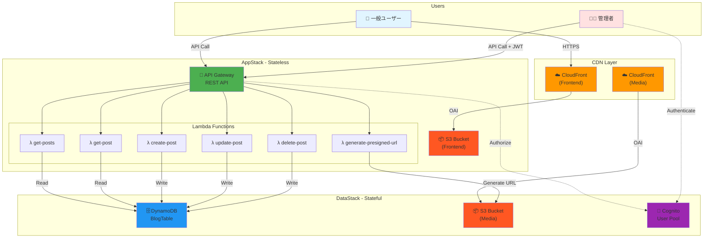

# MyBlog-AWS 最終アーキテクチャドキュメント

> **作成日**: 2026年2月11日  
> **バージョン**: 1.0  
> **ステータス**: 実装完了

---

## 目次

1. [概要](#概要)
2. [アーキテクチャ概要図](#アーキテクチャ概要図)
3. [詳細アーキテクチャ図](#詳細アーキテクチャ図)
4. [リソース一覧](#リソース一覧)
5. [データフロー](#データフロー)
6. [セキュリティ設計](#セキュリティ設計)
7. [スケーラビリティ](#スケーラビリティ)
8. [コスト試算](#コスト試算)
9. [デプロイ手順](#デプロイ手順)

---

## 概要

MyBlog-AWSは、AWS CDKを使用して構築されたサーバーレスブログアプリケーションです。2つのCDK Stack（DataStackとAppStack）で構成され、完全なRESTful APIとフロントエンドホスティング環境を提供します。

### 主要な特徴

- **サーバーレスアーキテクチャ**: Lambda, API Gateway, DynamoDB
- **高速コンテンツ配信**: CloudFront CDN（Frontend + Media）
- **セキュアな認証**: Amazon Cognito User Pool
- **Infrastructure as Code**: AWS CDK（TypeScript）
- **完全なCRUD操作**: 記事の作成・読取・更新・削除
- **画像アップロード機能**: S3 Pre-signed URL
- **管理者/一般ユーザー分離**: API Gateway + Cognito Authorizer

---

## アーキテクチャ概要図



---

## 詳細アーキテクチャ図

```mermaid
graph TB
    subgraph "Internet"
        User["👤 一般ユーザー<br/>公開記事閲覧"]
        Admin["👨‍💼 管理者<br/>記事管理・作成"]
    end

    subgraph "CloudFront Distribution"
        CFWeb["☁️ CloudFront<br/>Frontend Distribution<br/>d1234567890.cloudfront.net"]
        CFMedia["☁️ CloudFront<br/>Media Distribution<br/>d0987654321.cloudfront.net"]
    end

    subgraph "AppStack【Stateless】"
        subgraph "Frontend Hosting"
            S3Web["📦 S3 Bucket<br/>Frontend Assets<br/>HTML/CSS/JS"]
            OAI1["🔒 OAI<br/>Origin Access Identity"]
        end

        subgraph "API Gateway"
            APIGW["🚪 API Gateway REST API<br/>https://xxx.execute-api.region.amazonaws.com/prod"]
            AuthZ["🔐 Cognito Authorizer<br/>JWT Validation"]
            
            subgraph "Public Endpoints"
                EP1["/posts<br/>GET"]
                EP2["/posts/{id}<br/>GET"]
            end
            
            subgraph "Admin Endpoints"
                EP3["/admin/posts<br/>GET"]
                EP4["/admin/posts<br/>POST"]
                EP5["/admin/posts/{id}<br/>GET/PUT/DELETE"]
                EP6["/admin/presigned-url<br/>POST"]
            end
        end

        subgraph "Lambda Layer"
            L1["λ get-posts<br/>128MB/10s<br/>記事一覧取得"]
            L2["λ get-post<br/>128MB/10s<br/>記事詳細取得"]
            L3["λ create-post<br/>128MB/10s<br/>記事作成"]
            L4["λ update-post<br/>128MB/10s<br/>記事更新"]
            L5["λ delete-post<br/>128MB/10s<br/>記事削除"]
            L6["λ generate-presigned-url<br/>128MB/10s<br/>URL生成"]
        end
    end

    subgraph "DataStack【Stateful】"
        subgraph "Database"
            DDB["🗄️ DynamoDB Table<br/>BlogTable<br/>On-Demand Billing"]
            
            subgraph "DynamoDB Schema"
                PK["PK: POST#postId"]
                SK["SK: METADATA | BLOCK#n | TAG#name | STATUS#status"]
                GSI["GSI1: sk-pk-index"]
            end
        end

        subgraph "Media Storage"
            S3Media["📦 S3 Bucket<br/>Media Files<br/>Images/Videos"]
            OAI2["🔒 OAI<br/>Origin Access Identity"]
            LC["♻️ Lifecycle Policy<br/>30days→IA<br/>90days→Delete"]
        end

        subgraph "Authentication"
            Cognito["🔐 Cognito User Pool<br/>Admin Authentication"]
            UserPoolClient["📱 User Pool Client<br/>Web Application"]
        end
    end

    subgraph "Permissions & Security"
        IAM1["IAM Role<br/>Lambda→DynamoDB Read"]
        IAM2["IAM Role<br/>Lambda→DynamoDB Write"]
        IAM3["IAM Role<br/>Lambda→S3 Put"]
    end

    %% Frontend Flow
    User -->|"1. Access Website"| CFWeb
    CFWeb -->|OAI| OAI1
    OAI1 -->|Read| S3Web

    %% Public API Flow
    User -->|"2. GET /posts"| EP1
    User -->|"3. GET /posts/{id}"| EP2
    EP1 --> L1
    EP2 --> L2

    %% Admin Authentication
    Admin -->|"4. Login"| Cognito
    Cognito -->|"5. JWT Token"| Admin

    %% Admin API Flow
    Admin -->|"6. JWT + API Call"| EP3 & EP4 & EP5 & EP6
    EP3 & EP5 -->|Authorize| AuthZ
    EP4 & EP6 -->|Authorize| AuthZ
    AuthZ -->|Validate JWT| Cognito

    EP3 --> L1
    EP4 --> L3
    EP5 --> L2 & L4 & L5
    EP6 --> L6

    %% Lambda→DynamoDB
    L1 -->|Query| DDB
    L2 -->|Query| DDB
    L3 -->|TransactWrite| DDB
    L4 -->|TransactWrite| DDB
    L5 -->|TransactWrite| DDB

    %% Lambda→S3
    L6 -->|"Generate Pre-signed URL"| S3Media
    Admin -->|"7. PUT to Pre-signed URL"| S3Media

    %% Media Delivery
    S3Media -->|OAI| OAI2
    OAI2 -->|Read| CFMedia
    User -->|"8. Load Images"| CFMedia

    %% IAM
    L1 & L2 -.->|Assume| IAM1
    L3 & L4 & L5 -.->|Assume| IAM2
    L6 -.->|Assume| IAM3

    %% DynamoDB Internal
    DDB --> PK & SK & GSI

    %% S3 Lifecycle
    S3Media --> LC

    %% Styling
    style User fill:#e1f5ff
    style Admin fill:#ffe1e1
    style CFWeb fill:#ff9800
    style CFMedia fill:#ff9800
    style APIGW fill:#4caf50
    style AuthZ fill:#9c27b0
    style L1 fill:#ffeb3b
    style L2 fill:#ffeb3b
    style L3 fill:#ffeb3b
    style L4 fill:#ffeb3b
    style L5 fill:#ffeb3b
    style L6 fill:#ffeb3b
    style DDB fill:#2196f3
    style S3Media fill:#ff5722
    style S3Web fill:#ff5722
    style Cognito fill:#9c27b0
```



---

## リソース一覧

### DataStack（Stateful Resources）

| リソース | タイプ | 用途 | 主要設定 |
|---------|--------|------|---------|
| **BlogTable** | DynamoDB Table | 記事データ保存 | On-Demand, PITR有効, GSI1 |
| **MediaBucket** | S3 Bucket | 画像・動画保存 | Versioning, Lifecycle Policy |
| **MediaDistribution** | CloudFront | メディア配信 | OAI, Price Class 200 |
| **UserPool** | Cognito User Pool | 管理者認証 | Email認証, MFA Optional |
| **UserPoolClient** | Cognito Client | アプリケーション統合 | SRP認証, OAuth |

### AppStack（Stateless Resources）

| リソース | タイプ | 用途 | 主要設定 |
|---------|--------|------|---------|
| **FrontendBucket** | S3 Bucket | フロントエンド保存 | 静的Webホスティング |
| **FrontendDistribution** | CloudFront | フロントエンド配信 | OAI, SPA対応 |
| **MyBlogApi** | API Gateway | REST API | CORS, ログ, メトリクス |
| **CognitoAuthorizer** | API Authorizer | 管理者認証 | JWT検証 |
| **GetPostsFunction** | Lambda | 記事一覧取得 | Node.js 18, 128MB |
| **GetPostFunction** | Lambda | 記事詳細取得 | Node.js 18, 128MB |
| **CreatePostFunction** | Lambda | 記事作成 | Node.js 18, 128MB |
| **UpdatePostFunction** | Lambda | 記事更新 | Node.js 18, 128MB |
| **DeletePostFunction** | Lambda | 記事削除 | Node.js 18, 128MB |
| **GeneratePresignedUrlFunction** | Lambda | URL生成 | Node.js 18, 128MB |

---

## データフロー

### 1. 一般ユーザーの記事閲覧フロー

```
1. ブラウザ
   ↓ HTTPS GET
2. CloudFront (Frontend)
   ↓ OAI
3. S3 Bucket (Frontend) → index.html返却
   ↓
4. ブラウザでReact App起動
   ↓ API Call: GET /posts
5. API Gateway
   ↓ Lambda Integration
6. Lambda (get-posts)
   ↓ DynamoDB Query (GSI1: STATUS#published)
7. DynamoDB
   ↓ レスポンス
8. Lambda → API Gateway → ブラウザ
   ↓ 記事一覧表示
9. ユーザーが記事クリック
   ↓ API Call: GET /posts/{postId}
10. Lambda (get-post)
   ↓ DynamoDB Query (PK = POST#{postId})
11. DynamoDB
   ↓ METADATA + BLOCK + TAG
12. Lambda → API Gateway → ブラウザ
   ↓ 記事詳細表示（本文・画像含む）
13. ブラウザが画像をロード
   ↓ HTTPS GET
14. CloudFront (Media)
   ↓ OAI
15. S3 Bucket (Media) → 画像返却
```

### 2. 管理者の記事作成フロー

```
1. 管理者がログイン
   ↓ POST (email + password)
2. Cognito User Pool
   ↓ JWT Token発行
3. ブラウザにJWT保存
   ↓
4. 画像アップロード
   ↓ POST /admin/presigned-url + JWT
5. API Gateway → Cognito Authorizer（JWT検証）
   ↓ Lambda Integration
6. Lambda (generate-presigned-url)
   ↓ S3 Pre-signed URL生成（15分有効）
7. Lambda → API Gateway → ブラウザ
   ↓ uploadUrl + fileUrl
8. ブラウザ
   ↓ PUT to uploadUrl（画像データ）
9. S3 Bucket (Media) → 画像保存
   ↓
10. 記事作成
   ↓ POST /admin/posts + JWT
   ↓ Body: {title, contentBlocks: [{type:"image", content:fileUrl}], ...}
11. API Gateway → Cognito Authorizer（JWT検証）
   ↓ Lambda Integration
12. Lambda (create-post)
   ↓ ULID生成 (postId)
   ↓ DynamoDB TransactWrite
      - METADATA
      - BLOCK#1, BLOCK#2, ...
      - TAG#AWS, TAG#CDK, ...
      - STATUS#draft
13. DynamoDB → 保存完了
   ↓ レスポンス
14. Lambda → API Gateway → ブラウザ
   ↓ 記事作成成功
```

### 3. 記事公開フロー

```
1. 管理者が「公開」ボタンクリック
   ↓ PUT /admin/posts/{postId} + JWT
   ↓ Body: {status: "published"}
2. API Gateway → Cognito Authorizer（JWT検証）
   ↓ Lambda Integration
3. Lambda (update-post)
   ↓ DynamoDB TransactWrite
      - METADATA: status更新
      - STATUS#draft削除
      - STATUS#published追加
4. DynamoDB → 更新完了
   ↓
5. 一般ユーザーがアクセス
   ↓ GET /posts
6. Lambda (get-posts)
   ↓ GSI1 Query (sk = STATUS#published)
7. DynamoDB → 公開記事のみ返却
```

---

## セキュリティ設計

### 1. 認証・認可

```
┌─────────────────────────────────────────────────────────┐
│ 一般ユーザー                                              │
├─────────────────────────────────────────────────────────┤
│ 認証: なし                                                │
│ アクセス: 公開記事のみ（status = published）              │
│ エンドポイント:                                          │
│   - GET /posts                                          │
│   - GET /posts/{postId}                                 │
└─────────────────────────────────────────────────────────┘

┌─────────────────────────────────────────────────────────┐
│ 管理者                                                   │
├─────────────────────────────────────────────────────────┤
│ 認証: Cognito User Pool (JWT)                           │
│ 検証: API Gateway Cognito Authorizer                    │
│ アクセス: すべての記事（draft/published/archived）       │
│ エンドポイント:                                          │
│   - GET /admin/posts（全記事）                           │
│   - POST /admin/posts（作成）                           │
│   - PUT /admin/posts/{postId}（更新）                   │
│   - DELETE /admin/posts/{postId}（削除）                │
│   - POST /admin/presigned-url（画像アップロード）        │
└─────────────────────────────────────────────────────────┘
```

### 2. IAM権限（最小権限の原則）

| Lambda関数 | DynamoDB権限 | S3権限 | 理由 |
|-----------|-------------|--------|------|
| get-posts | Query, GetItem | なし | 読み取りのみ |
| get-post | Query | なし | 読み取りのみ |
| create-post | PutItem, TransactWrite | なし | 書き込みのみ |
| update-post | UpdateItem, GetItem, TransactWrite | なし | 更新のみ |
| delete-post | DeleteItem, TransactWrite | なし | 削除のみ |
| generate-presigned-url | なし | PutObject | URL生成のみ |

### 3. ネットワークセキュリティ

```
- S3 Bucket: ブロックパブリックアクセス有効
  → CloudFront OAI経由のみアクセス可能

- API Gateway: HTTPS必須
  → HTTP→HTTPSリダイレクト

- Lambda: VPC不要（DynamoDB/S3はAWS内部ネットワーク）

- Cognito: パスワードポリシー
  → 12文字以上、大小英字・数字・記号必須
  → MFA Optional（TOTP）
```

### 4. データ保護

```
- DynamoDB: 保存時暗号化（AWS管理キー）
- S3: 保存時暗号化（SSE-S3）
- CloudFront: TLS 1.2以上
- Cognito: JWT（RS256署名）
```

---

## スケーラビリティ

### 1. 自動スケーリング

```
DynamoDB:
- On-Demand課金モード
- 無制限のスケーラビリティ
- トラフィック増加に自動対応

Lambda:
- 同時実行数: デフォルト1000（リージョン単位）
- 自動スケーリング
- コールドスタート対策: 関数外で初期化

API Gateway:
- デフォルトスロットリング: 10,000 req/sec
- バーストリミット: 5,000 req
- 自動スケーリング

CloudFront:
- グローバルエッジロケーション
- 無制限のスケーラビリティ
```

### 2. パフォーマンス最適化

```
CloudFront Cache:
- GET /posts: 5分TTL
- GET /posts/{postId}: 1時間TTL
- 画像・動画: CACHING_OPTIMIZED

Lambda最適化:
- メモリ: 128MB（コスト最適）
- タイムアウト: 10秒
- Cold Start対策:
  - DynamoDB Client初期化を関数外
  - 依存関係の最小化
  - esbuild bundling + minify

DynamoDB最適化:
- GSI1による効率的なクエリ
- Single Table Design
- 射影（Projection）で必要な属性のみ取得
```

---

## コスト試算

### 初期段階（月間1,000PV）

```
AWS無料枠内:
- DynamoDB: 25GB, 25 WCU/RCU（無料枠内）
- Lambda: 100万リクエスト（無料枠内）
- API Gateway: 100万リクエスト（無料枠内）
- S3: 5GB（無料枠内）
- CloudFront: 50GB（無料枠内）

有料部分:
- Route53 HostedZone: $0.50/月（オプション）

合計: 約$0.50/月（Route53使用時）
または  $0/月（Route53不使用）
```

### 成長後（月間10,000PV、無料枠終了後）

```
DynamoDB:
- ストレージ: 1GB → $0.25
- On-Demand: 10万read, 1万write → $2.75

Lambda:
- 実行: 10万リクエスト × 1秒 → $0.0017
- メモリ: 128MB → $0.21

API Gateway:
- リクエスト: 10万 → $0.35

S3:
- ストレージ: 10GB → $0.23
- リクエスト: 10万 GET → $0.04

CloudFront:
- データ転送: 50GB → $4.25
- リクエスト: 10万 → $0.01

合計: 約$8.09/月
（Route53含めると約$8.59/月）
```

---

## デプロイ手順

### 前提条件

```bash
- Node.js 18以上
- AWS CLI設定済み
- AWS CDK CLI インストール済み
- IAM権限（AdministratorAccess推奨）
```

### 1. 依存関係インストール

```bash
cd myblog-aws
npm install

# 各Lambda関数の依存関係
cd lambda/get-posts && npm install && cd ../..
cd lambda/get-post && npm install && cd ../..
cd lambda/create-post && npm install && cd ../..
cd lambda/update-post && npm install && cd ../..
cd lambda/delete-post && npm install && cd ../..
cd lambda/generate-presigned-url && npm install && cd ../..
```

### 2. CDK Bootstrap（初回のみ）

```bash
cdk bootstrap aws://ACCOUNT_ID/REGION --profile myblog-dev
```

### 3. デプロイ

```bash
# ビルド
npm run build

# 差分確認
cdk diff --profile myblog-dev

# デプロイ（全Stack）
cdk deploy --all --profile myblog-dev

# または個別デプロイ
cdk deploy MyBlog-DataStack --profile myblog-dev
cdk deploy MyBlog-AppStack --profile myblog-dev
```

### 4. 出力確認

```bash
# デプロイ完了後、以下の情報が出力される

MyBlog-DataStack:
  TableName = MyBlogDataStack-MyBlogTable-XXXXX
  MediaBucketName = myblogdatastack-mediabucket-xxxxx
  MediaDistributionDomainName = d0987654321.cloudfront.net
  UserPoolId = ap-northeast-1_XXXXX
  UserPoolClientId = xxxxxxxxxxxxx

MyBlog-AppStack:
  FrontendBucketName = myblogappstack-frontendbucket-xxxxx
  DistributionDomainName = d1234567890.cloudfront.net
  ApiUrl = https://xxxxx.execute-api.ap-northeast-1.amazonaws.com/prod
```

### 5. 管理者ユーザー作成

```bash
# Cognito Userを作成
aws cognito-idp admin-create-user \
  --user-pool-id <USER_POOL_ID> \
  --username admin \
  --user-attributes Name=email,Value=your-email@example.com \
  --profile myblog-dev

# パスワード設定
aws cognito-idp admin-set-user-password \
  --user-pool-id <USER_POOL_ID> \
  --username admin \
  --password YourSecurePassword123! \
  --permanent \
  --profile myblog-dev
```

### 6. 動作確認

```bash
# 一般ユーザー向けAPI（認証不要）
curl https://xxxxx.execute-api.region.amazonaws.com/prod/posts

# 管理者向けAPI（JWT必要）
# 1. Cognitoでログインしてトークン取得
# 2. curlでテスト
curl -H "Authorization: Bearer <JWT_TOKEN>" \
  https://xxxxx.execute-api.region.amazonaws.com/prod/admin/posts
```

---

## まとめ

本アーキテクチャは以下の要件を満たします：

✅ **スケーラビリティ**: サーバーレスで自動スケーリング  
✅ **セキュリティ**: Cognito認証、IAM最小権限、暗号化  
✅ **パフォーマンス**: CloudFront CDN、DynamoDB On-Demand  
✅ **コスト最適化**: 無料枠活用、従量課金  
✅ **保守性**: Infrastructure as Code（CDK）  
✅ **可用性**: マルチAZ、自動バックアップ（PITR）

---

**次のステップ**: フロントエンド実装 → 統合テスト → 本番デプロイ
